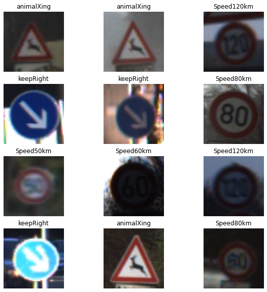
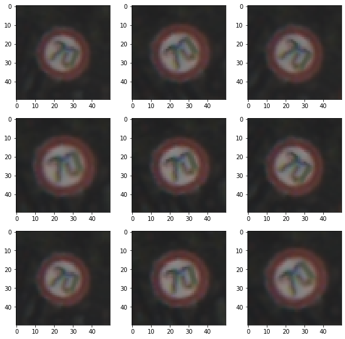
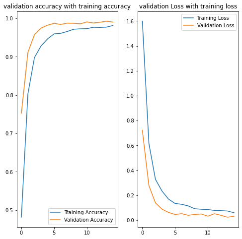
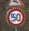

### Import libraries


```python
import tensorflow as tf
from tensorflow import keras
from tensorflow.keras import layers
from tensorflow.keras.models import Sequential
from PIL import Image
import matplotlib.pyplot as plt
import numpy as np
import random
import os
import glob
import matplotlib.pyplot as plt
```

### Verify dataset directory and contents

The dataset is a subset of the GTSRB from kaggle
The data directory shoud contain both the training and the test set


```python
dataDirectory = ('C:/Users/Jeff/Desktop/GTSDS/')
trainingDirectory = dataDirectory+'training/'
testDirectory = dataDirectory+'test/'
print (dataDirectory)
print (trainingDirectory)
print (testDirectory)
```

    C:/Users/Jeff/Desktop/GTSDS/
    C:/Users/Jeff/Desktop/GTSDS/training/
    C:/Users/Jeff/Desktop/GTSDS/test/
    

find the number of all the recursive files listed in the training directory
The total number of the GTSRB should be 23519 files


```python
files = glob.glob(trainingDirectory + '*/*.png')
imageCount = len(files)
print(imageCount, "files found in" , trainingDirectory)
```

    23519 files found in C:/Users/Jeff/Desktop/GTSDS/training/
    

###  build training and val set

Parameter defines to load.
resized image to 50 to keep consistancy and speed up training.
Smaller image sizes causes accuracy to decreases drastically


```python
batchSize = 32
resizeHeight = 50
resizeWidth = 50
```

Split the data into 80% train and 20% validation


```python
trainDataset = tf.keras.preprocessing.image_dataset_from_directory(
  trainingDirectory,
  validation_split=0.2,
  subset="training",
  seed=123,
  image_size=(resizeHeight, resizeWidth),
  batch_size=batchSize)

validationDataset = tf.keras.preprocessing.image_dataset_from_directory(
  trainingDirectory,
  validation_split=0.2,
  subset="validation",
  seed=123,
  image_size=(resizeHeight, resizeWidth),
  batch_size=batchSize)
```

    Found 23519 files belonging to 23 classes.
    Using 18816 files for training.
    Found 23519 files belonging to 23 classes.
    Using 4703 files for validation.
    

List the classes


```python
class_names = validationDataset.class_names
print("List of classes")
print(class_names)
```

    List of classes
    ['DangerLeft', 'DangerRight', 'NoEnter', 'Speed100km', 'Speed120km', 'Speed20km', 'Speed30km', 'Speed50km', 'Speed60km', 'Speed70km', 'Speed80km', 'animalXing', 'bikesXing', 'childrenXing', 'iceSnow', 'keepLeft', 'keepRight', 'pedestrians', 'roundAbout', 'stop', 'turnLeft', 'turnRight', 'yield']
    

### Visualize the data

Check that the data matches with the classes they belong to before training


```python
plt.figure(figsize=(10, 10))
for images, labels in trainDataset.take(1):
  for i in range(12):
    ax = plt.subplot(4, 3, i + 1)
    plt.imshow(images[i].numpy().astype("uint8"))
    plt.title(class_names[labels[i]])
    plt.axis("off")
```


    

    


Create datasets for model to train on.
The batch for the images should be shaped as (32x50x50x3)


```python
for imageBatch, labelsBatch in trainDataset:
  image_batch_np = np.stack(list(imageBatch))
  labels_batch_np = np.stack(list(labelsBatch))
  break

print(image_batch_np.shape)
print(labels_batch_np.shape)
```

    (32, 50, 50, 3)
    (32,)
    

### prepare dataset for optimal training


shuffle and store the training and validation images in cache to try to prevent bottlenecks while during training


```python
AUTOTUNE = tf.data.AUTOTUNE

trainDataset = trainDataset.cache().shuffle(1000).prefetch(buffer_size=AUTOTUNE)
validationDataset = validationDataset.cache().prefetch(buffer_size=AUTOTUNE)
```

### Normalization Layer

The last column of the image batch are the color channel values, represented in range 0x00 - 0xFF. Rescale the values to be between zero and 1 for the normaization layer

note(this is a exerimental function in keras and is considered volatile)


```python
normalizationLayer = layers.experimental.preprocessing.Rescaling(1./255)
```

Apply rescaled layer to the dataset


```python
normalizedDataset = trainDataset.map(lambda x, y: (normalizationLayer(x), y))
image_batch_np, labels_batch_np = next(iter(normalizedDataset))
first_image = image_batch_np[0]

print(np.min(first_image), np.max(first_image)) 
```

    0.047058795 1.0
    

### Data augmentation

Augment the training data to reduce overfitting


```python
data_augmentation = keras.Sequential(
  [
    layers.experimental.preprocessing.RandomContrast(0.05, 
                                                 input_shape=( resizeHeight, 
                                                              resizeWidth,
                                                              3)),
    layers.experimental.preprocessing.RandomRotation(0.1),
    layers.experimental.preprocessing.RandomZoom(0.1),
  ]
)
```
plot samples of the augmented samples

```python
plt.figure(figsize=(10, 10))
for images, _ in trainDataset.take(1):
  for i in range(9):
    augmented_images = data_augmentation(images)
    ax = plt.subplot(3, 3, i + 1)
    plt.imshow(augmented_images[0].numpy().astype("uint8"))
```


    

    


### Dropout

add the dropout layer and data augmentation layers


```python
numberClasses = 23
model = Sequential([
  data_augmentation,
  layers.experimental.preprocessing.Rescaling(1./255),
  layers.Conv2D(16, 3, padding='same', activation='relu'),
  layers.MaxPooling2D(),
  layers.Conv2D(32, 3, padding='same', activation='relu'),
  layers.MaxPooling2D(),
  layers.Conv2D(64, 3, padding='same', activation='relu'),
  layers.MaxPooling2D(),
  layers.Dropout(0.2),
  layers.Flatten(),
  layers.Dense(128, activation='relu'),
  layers.Dense(numberClasses)
])
```

### Compile and train the model


```python
model.compile(optimizer='adam',
              loss=tf.keras.losses.SparseCategoricalCrossentropy(from_logits=True),
              metrics=['accuracy'])
```


```python
model.summary()
```

    Model: "sequential_1"
    _________________________________________________________________
    Layer (type)                 Output Shape              Param #   
    =================================================================
    sequential (Sequential)      (None, 50, 50, 3)         0         
    _________________________________________________________________
    rescaling_1 (Rescaling)      (None, 50, 50, 3)         0         
    _________________________________________________________________
    conv2d (Conv2D)              (None, 50, 50, 16)        448       
    _________________________________________________________________
    max_pooling2d (MaxPooling2D) (None, 25, 25, 16)        0         
    _________________________________________________________________
    conv2d_1 (Conv2D)            (None, 25, 25, 32)        4640      
    _________________________________________________________________
    max_pooling2d_1 (MaxPooling2 (None, 12, 12, 32)        0         
    _________________________________________________________________
    conv2d_2 (Conv2D)            (None, 12, 12, 64)        18496     
    _________________________________________________________________
    max_pooling2d_2 (MaxPooling2 (None, 6, 6, 64)          0         
    _________________________________________________________________
    dropout (Dropout)            (None, 6, 6, 64)          0         
    _________________________________________________________________
    flatten (Flatten)            (None, 2304)              0         
    _________________________________________________________________
    dense (Dense)                (None, 128)               295040    
    _________________________________________________________________
    dense_1 (Dense)              (None, 23)                2967      
    =================================================================
    Total params: 321,591
    Trainable params: 321,591
    Non-trainable params: 0
    _________________________________________________________________
    


```python
epochs = 15
history = model.fit(
  trainDataset,
  validation_data=validationDataset,
  epochs=epochs
)
```

    Epoch 1/15
    588/588 [==============================] - 71s 119ms/step - loss: 2.1467 - accuracy: 0.3319 - val_loss: 0.7209 - val_accuracy: 0.7525
    Epoch 2/15
    588/588 [==============================] - 66s 112ms/step - loss: 0.7338 - accuracy: 0.7623 - val_loss: 0.2765 - val_accuracy: 0.9113
    Epoch 3/15
    588/588 [==============================] - 67s 114ms/step - loss: 0.3672 - accuracy: 0.8826 - val_loss: 0.1379 - val_accuracy: 0.9577
    Epoch 4/15
    588/588 [==============================] - 67s 114ms/step - loss: 0.2394 - accuracy: 0.9267 - val_loss: 0.0875 - val_accuracy: 0.9745
    Epoch 5/15
    588/588 [==============================] - 68s 115ms/step - loss: 0.1703 - accuracy: 0.9446 - val_loss: 0.0613 - val_accuracy: 0.9821
    Epoch 6/15
    588/588 [==============================] - 65s 111ms/step - loss: 0.1364 - accuracy: 0.9575 - val_loss: 0.0449 - val_accuracy: 0.9870
    Epoch 7/15
    588/588 [==============================] - 67s 113ms/step - loss: 0.1282 - accuracy: 0.9611 - val_loss: 0.0514 - val_accuracy: 0.9841
    Epoch 8/15
    588/588 [==============================] - 65s 111ms/step - loss: 0.1196 - accuracy: 0.9645 - val_loss: 0.0382 - val_accuracy: 0.9875
    Epoch 9/15
    588/588 [==============================] - 64s 110ms/step - loss: 0.0908 - accuracy: 0.9720 - val_loss: 0.0451 - val_accuracy: 0.9870
    Epoch 10/15
    588/588 [==============================] - 66s 112ms/step - loss: 0.0737 - accuracy: 0.9774 - val_loss: 0.0489 - val_accuracy: 0.9858
    Epoch 11/15
    588/588 [==============================] - 69s 118ms/step - loss: 0.0922 - accuracy: 0.9700 - val_loss: 0.0312 - val_accuracy: 0.9906
    Epoch 12/15
    588/588 [==============================] - 67s 113ms/step - loss: 0.0742 - accuracy: 0.9786 - val_loss: 0.0510 - val_accuracy: 0.9879
    Epoch 13/15
    588/588 [==============================] - 67s 113ms/step - loss: 0.0762 - accuracy: 0.9766 - val_loss: 0.0381 - val_accuracy: 0.9898
    Epoch 14/15
    588/588 [==============================] - 66s 113ms/step - loss: 0.0747 - accuracy: 0.9759 - val_loss: 0.0229 - val_accuracy: 0.9926
    Epoch 15/15
    588/588 [==============================] - 66s 112ms/step - loss: 0.0539 - accuracy: 0.9839 - val_loss: 0.0308 - val_accuracy: 0.9902
    

## Visualize training results

After applying data augmentation and Dropout, there is less overfitting than before, and training and validation accuracy are closer aligned. 


```python
accuracy = history.history['accuracy']
validationAccuracy = history.history['val_accuracy']
loss = history.history['loss']
validLoss = history.history['val_loss']
epochsRange = range(epochs)
```


```python
plt.figure(figsize=(8, 8))
plt.subplot(1, 2, 1)
plt.plot(epochsRange, accuracy, label='Training Accuracy')
plt.plot(epochsRange, validationAccuracy, label='Validation Accuracy')
plt.legend(loc='lower right')
plt.title('validation accuracy with training accuracy')

plt.subplot(1, 2, 2)
plt.plot(epochsRange, loss, label='Training Loss')
plt.plot(epochsRange, validLoss, label='Validation Loss')
plt.legend(loc='upper right')
plt.title('validation Loss with training loss')
plt.show()
```


    

    


### Prediction

Use the model to predict a ramdomly selected test image


```python
import random

testlist = list(glob.glob(testDirectory+ '*.png'))

randimage = random.randint(0, (len(testlist)))

randimage = random.randint(0, (len(testlist)))
randimage =str(randimage)
randimage =(randimage.zfill(5))

testpath = (testDirectory + str(randimage) + '.png')
print(testpath)
```

    C:/Users/Jeff/Desktop/GTSDS/test/01454.png
    


```python

img = keras.preprocessing.image.load_img(
    testpath, target_size=(resizeHeight, resizeWidth)
)
imageArray = keras.preprocessing.image.img_to_array(img)
imageArray = tf.expand_dims(imageArray, 0) # Create a batch

predictions = model.predict(imageArray)
score = tf.nn.softmax(predictions[0])

print(100 * np.max(score), "%")
print(
    format(class_names[np.argmax(score)]))

Image.open(str(testpath))
```

    99.9998927116394 %
    Speed50km
    


    

    


```python

```
